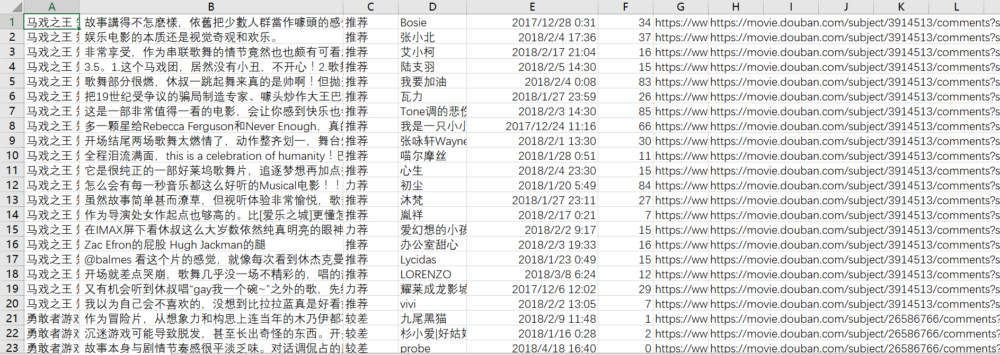
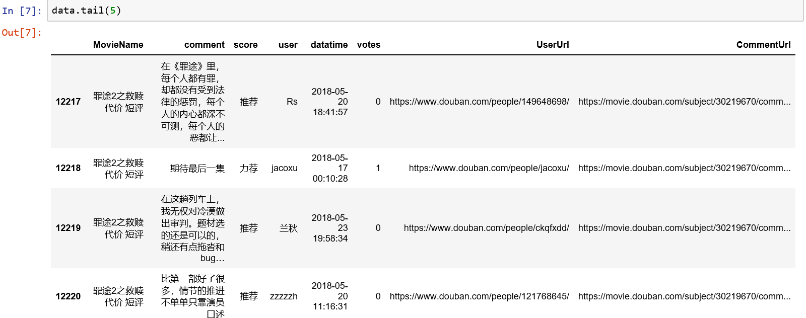
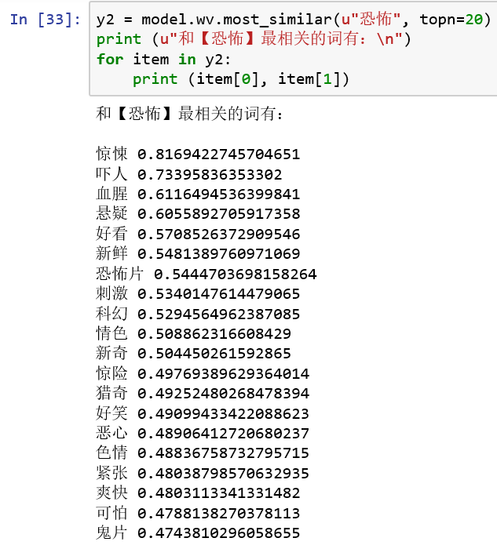
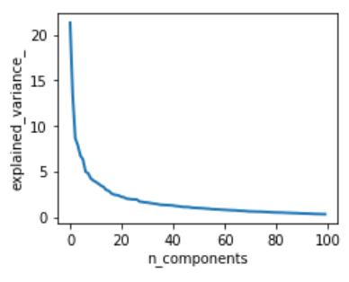
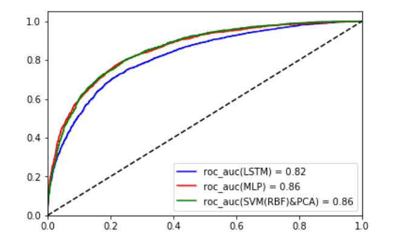
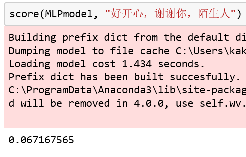
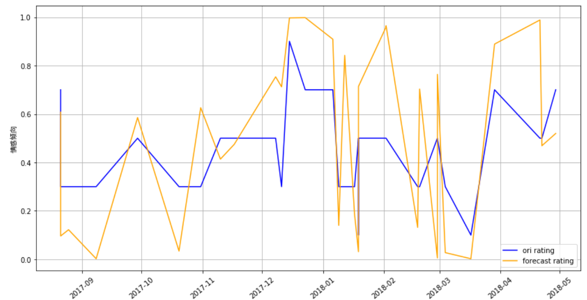
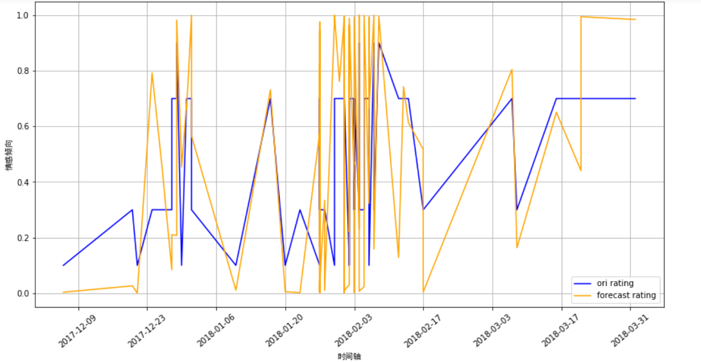

# Sentiment Analysis based on Douban Critics
This project was the final project of `Data Mining and Data warehouse`, which originally require students to crawl and analyze user critics data containing sentiment moods like positive mood or negative mood on weibo website. Due to ip address limitation and other conditions, I use user critics on movie topic on Douban website instead. It provides user scoring data on movie serving as supervising training and testing data.
***
	
|Author|Programming Language| GUI| Time|
|---|---|---|---
|Hang Yu|Python| Jupyter Notebook| 03/2018-05/2018

****
## Index
* [Summary](##Summary)
* [Main goal](##Main%20goal)
* [DataSet](##Gain%20of%20DataSet)
* [Data Preprocess](##Data%20Preprocess)
* [Feature Extraction](##Feature%20Extraction)
* [Build Classifier Model](##Build%20Classifier%20Model)
    * SVM(RBF) + PCA
    * MLP
    * LSTM
* [Theme Analysis](##Analysis%20on%20Overall%20Data)
* [Conclusions and Problems](##Conclusions%20and%20Problems)
* [Document Specification](##Document%20Specification)

****
## Summary
-  Crawled 100k+ critics and ratings from Douban.com using Scrapy, preprocessed data and converted to
word2vec models
-  Conducted SVM, MLP, LSTM classifier training, and compared their respective performance under different
test data; weighted model obtained AUC of 0.86 and KS of 0.56
-  Applied classifier to sentiment analysis, detailing the emotion tendency of particular users through given time
period and emotion tendency of specific genres with visualized graphics

****
## Main goal
1. Crawl ample movie critics on Douban website and store them on local database
2. Observe crawled data and preprocess crawled data to generate pure formated file for furture analysis
3. Build classifier model with different methods; train those classifier, test them and give appropriate assessment
4. Doing some drilling or segmenting job via classifier, analyse data on given perspective

****
## Gain of DataSet
DataSet gained from Scrapy. Since Douban website would ban web access from extra-active IP address, I have to take solution containing dynamic IP address + IP Proxy + Scrapy. Everytime valid IP address pass the test to access Douban website through `proxy.py`, they are added into IP pool for proxy. Then Scrapy crawls down most popular movies and their ID. Then each movie would offer 20 negative critic, 20 positive and 20 neutral as well as other information such as username, user bio, movie url, votes number etc. and these data would be saved in csv formatted file with their copy saved in SQLite.

****
## Data Preprocess
Crawled data need detailed preprocess to fit the requirement of classifier models.

For easy presentaion and ample operatable tool lib, I use jupyter notebook to run python script and use numpy module to preprocess data.

Raw data obviously have several flaws:  
1. Every movie name contained words like '短评' which is unnecessory.
2. Some critics is writen by unsimplified Chinese and should be transformed into simplified Chinese.
3. Input data should be processed by stemming tool and segmenting tool and need to remove the stop words

After utilizing `jieba` module to purify the raw data, I now have two data files including one only containing positive critics and one negative.

****
## Feature Extraction
Critics are now still characteristics rather than real number that is easy to calculate. Feasible option to extract features inculds TFIDF, BOW model and other tools like Doc2vec and Word2vec etc.. This project use word2vec to build word wectors due to the three following facts: 1. it save sementic contexts information 2. its efficiency proves to outperform Doc2vec 3. its easy to implement with python module support.

Corpus is necessory for building word embeddings, especially corpus containing popular expressions appeared in critics. Actually, I use more than 170 thousands critics crawled before from Douban website to build word corpus, and this homologous charateristic contributes to more overlap on popular net speak and movie jargon and would gain better effect.

Then word2vec is rapidly build up through `sklearn` machine learning library. Now I do some litte test about this word2vec model by find the most similar word and we can find that the higher similarity score ther more they are similar to the source word. ('恐怖' means 'horror' in Chinese) 

****
## Build Classifier Model
Since `sklearn` provides fine implementation on tensorflow framework or some other low-level framework like theano as well as accept configuration and design from end user, I directly use `sklearn` and `keras` to design and implement the architecture of classifier model. This phase mainly includes the generation of testing and training data, build and test of classifier model, comparason of different model and their storage.

First I build two types of input vector from text input files we generate before through function 'buildWordVec'.
  

Then we get test set and train set via 'train_test_split' function. As is necessory to be mentioned, we can use PCA to trancate the size of vector to 100 dimension without too much loss, then PCA is well worthy taken into consideration.

Then we implement three type of classifier to compare their performance and precision.

### 1. SVM(RBF) + PCA
PCA can effectively improve the efficiency of algorithm and speed up the training speed.The support vector machine with gaussian kernel function was selected to divide the data by constructing a high-dimensional hyperplane, and its classification performance was more relaxed. Moreover, the model performance was significantly improved after the dimensionality reduction of PCA, and most of the misclassified negative texts were classified as positive texts.  
AUC=0.87, KSvalue=0.53.  

### 2. MLP
Compared with SVM (RBF), the classification of MLP is more strict, and PCA has little effect on the accuracy of the model after dimensionality reduction. The misclassification is mostly positive text, which is classified as negative. In fact, it is easier to overfit.

### 3. LSTM
LSTM is mainly used to compare with MLP to compare its ability to classify long texts. The fact shows that there is no significant difference between the two in short texts, but slightly better than MLP in longer texts. Finally, a compromise between LSTM and MLP is selected.  
AUC = 0.82.

Plus their KS-value are real similar.  

  

Finally the classifier models are saved in files( 'mlpmodel.h5' and 'lstmmodel.h5' ) in the '/outputs' directory

****
## Analysis on Overall Data
From the established model, the positive and negative emotional tendency of a certain text can be judged at will. The model outputs a number from 0 to 1, the closer to 1, the more negative semantic meanings the sentense contain, and the closer to 0, the more positive. Actually I take the probability the sentense would be classified as positive critics or negative ciritics as their final score.

LSTM and MLP scores were used as the prediction results in this project. For example, '好开心，谢谢你，陌生人' ( which means "I'm so happy, thank you, stranger" in Chinese ) was rated at 0.067, indicating a high level of positive emotion.

We can apply this model on two perspectives of analysis: the sentiment analysis of a certain user over a period of time and the sentiment analysis of a certain movie over a period of time.

###  Sentiment Analysis of a Certain User
First we look up the users with multiple comments on the raw data set using `pandas`. Then we construct a dataframe that contains all the comments of a user, their comment time and scores, then reorder them in chronological order.At the same time, all the comments are iterated, and the score value generated by the model is saved as the score list and finally displayed together with the original score.

The results show that the model has a good discriminating effect on the analysis of positive and negative emotions of large value. It maintains a relatively consistent tendency of emotional change, and has a deviation in the fuzzy emotional rating. The reason of difference between predicted score and real score may be that the comments of the medium review itself do not contain words with too obvious emotional tendency, since those critics just tend to tell a relevant story.

### Sentiment Analysis of a Certain movie
Similar to the user theme process is not covered here.The results also support previous speculation.

What's interesting is that at the beginning, the emotional tendency is more positive, but after a period of time, it will oscillate in the attachment of the evaluation, and then it will develop to the negative.

****
## Conclusions and Problems
It can be concluded that the accuracy rate and recall rate of different algorithms are not significantly different, and the combination of the classification effect of multiple classifiers can make more relevent judgment.

At the same time, some defects of the experiment are also taken into account:
1. With the inaccuracy of `jieba`, we need to find other support of professional word preprocessing tools for better word segmentation.

2. Training data is real scant and easy to overfit. We still need a lot of film review data, while attempt to crawl excess data face the threat of IP block

3. The comment text can be further processed, such as filtering out meaningless emojis and other meaningless symbols

****
## Document Specification
The crawler project is packaged in 'scrapy_spider' directory.

Please run on the jupyter notebook.

Inputs and outputs were median text files

'W2Vmodel' saves word2vec corpus model.

In `ipython` file, 'DataPreprocess' includes data preprocessing, 'DL_word2vec' includes classifier model, and 'modelView' includes data analysis and visualization.
